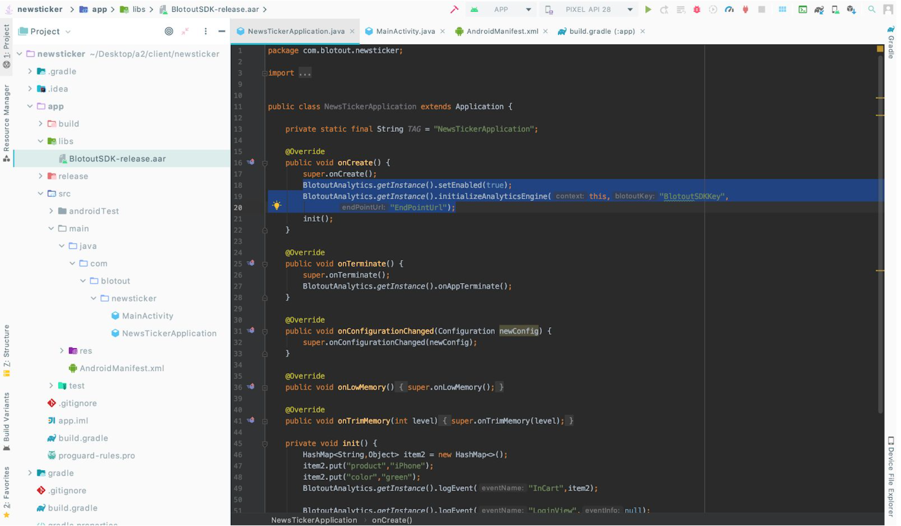

# Integration

## Download Link

[https://assets.blotout.io/latest/sdk/android.zip](https://assets.blotout.io/latest/sdk/android.zip)

## Add Blotout Analytics SDK into your project

To add the SDK to the Android project, simply add the “SDK aar file to libs folder into your Android project and follow the on screen instructions. Please refer to the image below for recommended settings, click finish.



## Add Required Gradle Dependency and libraries

## Gradle Library
```html
implementation fileTree(dir: 'libs', include: ['*.jar','*.aar'])
implementation ('com.birbit:android-priority-jobqueue:2.0.1')
implementation ('com.squareup.retrofit2:retrofit:2.6.2')
implementation group: 'com.fasterxml.jackson.core', name: 'jackson-databind', version: '2.9.8'
implementation 'com.squareup.retrofit2:converter-gson:2.3.0'
implementation group: 'com.squareup.retrofit2', name: 'converter-jackson', version: '2.6.2'
implementation 'com.squareup.okhttp3:logging-interceptor:3.10.0'
implementation "org.jetbrains.kotlin:kotlin-stdlib-jdk7:1.3.50"
implementation 'com.android.installreferrer:installreferrer:2.1'
```

## Android Manifest 
```html
<application>
 <receiver android:name="com.blotout.events.BODayChangedBroadcastReceiver">
        <intent-filter>
            <action android:name="android.intent.action.DATE_CHANGED"/>
            <action android:name="android.intent.action.TIMEZONE_CHANGED"/>
            <action android:name="android.intent.action.TIME_CHANGED"/>
        </intent-filter>
    </receiver>
   <receiver
            android:name="com.blotout.referrerapi.BOReferrerReceiver"
            android:enabled="true"
            android:exported="true">
            <intent-filter>
                <action android:name="com.android.vending.INSTALL_REFERRER" />
            </intent-filter>
   </receiver>
    <service android:name="com.blotout.analytics.BOClosingService" android:stopWithTask="false">
    </service>
</application>

<uses-permission android:name="android.permission.ACCESS_NETWORK_STATE" />
<uses-permission android:name="android.permission.ACCESS_WIFI_STATE" />

```

## Initialization

### Option 1 Java:

```html
import com.blotout.analytics.BlotoutAnalytics;


BlotoutAnalytics boaObj = BlotoutAnalytics.getInstance();
boaObj.initializeAnalyticsEngine(applicationContext,"BlotoutSDKKey","EndPointUrl");

```

### Option 2 Kotlin:
```html
var boaObj = BlotoutAnalytics.getInstance()
boaObj.initializeAnalyticsEngine(applicationContext,"BlotoutSDKKey","EndPointUrl");

```
