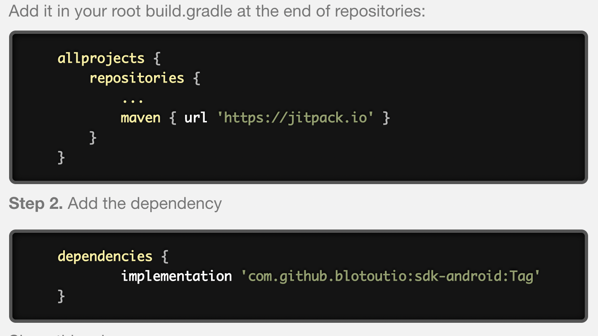

# Integration


## Add Blotout Analytics SDK into your project

To add the SDK to the Android project, Please refer to the image below for recommended settings, click finish.



## Add Required Gradle Dependency and libraries
```html
allprojects {
    repositories {
        maven { url 'https://jitpack.io' }
    }
}

implementation 'com.github.blotoutio:sdk-android:0.9.0'
```


## Initialization

### Option 1 Java: 

 Please initialize the BlotoutAnalytics in Android Application class.

```html
import com.blotout.analytics.BlotoutAnalytics;


        BlotoutAnalyticsConfiguration blotoutAnalyticsConfiguration = new BlotoutAnalyticsConfiguration();
        blotoutAnalyticsConfiguration.setBlotoutSDKKey("EADAH5FV8B5MMVZ");
        blotoutAnalyticsConfiguration.setEndPointUrl("https://stage.blotout.io/sdk/");
        BlotoutAnalytics.INSTANCE.init(this,blotoutAnalyticsConfiguration);

```

### Option 2 Kotlin:
```html
var blotoutAnalyticsConfiguration = BlotoutAnalyticsConfiguration()
blotoutAnalyticsConfiguration.blotoutSDKKey = "EADAH5FV8B5MMVZ"
blotoutAnalyticsConfiguration.endPointUrl = "https://stage.blotout.io/sdk/"
BlotoutAnalytics.INSTANCE.init(this,blotoutAnalyticsConfiguration)

```
